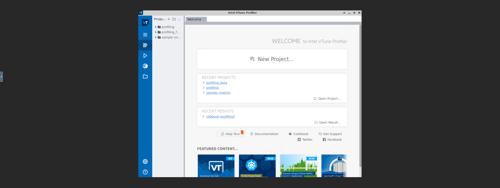

# Using the Luxembourgish National Supercomputer Meluxina

If you follow this course through the workshop organized by [Supercomputing Luxembourg](https://supercomputing.lu/), an allocation on [Meluxina](https://docs.lxp.lu/system/overview/) has been provided to you by [LuxProvide](https://www.luxprovide.lu/).

During this workshop, we will stringly rely on the National Supercomputer. Meluxina is a supercomputer located in Luxembourg, which began operation in 2021. It is part of the European High-Performance Computing (EuroHPC) Joint Undertaking, an initiative by the European Union to develop a world-class supercomputing ecosystem in Europe.

The Meluxina supercomputer is hosted by LuxProvide, the national HPC organization in Luxembourg. Its computing power is intended to be used for a wide range of tasks, such as data visualization, artificial intelligence, and simulating complex systems, serving both academic researchers and industry. The machine's architecture includes CPUs, GPUs and FPGAs. It is designed to be energy-efficient, utilizing technologies to reduce power consumption and lower its environmental footprint.

Meluxina's FPGA nodes have two 2 Intel [Stratix 10MX](https://www.intel.com/content/www/us/en/products/details/fpga/stratix/10/mx.html) 16 GB FPGA cards. The FPGA partition contains 20 nodes.

[](https://www.bittware.com/products/520n-mx/)

## Connecting to Meluxina

You should have received your credentials some days before the workshop. If not, please contact the organizer.
Please follow the LuxProvide [documentation](https://docs.lxp.lu/first-steps/quick_start/) to setup your access.

## Accessing the fpga partition


The oneAPI toolkit is evolving quite rapidely. In order to show the last features, the last version has been compiled for the course/workshop.


### Offline compilation

In order to use the oneAPI toolkit, you first need to take an interactive job. We strongly recommend to open a persistent terminal session using `tmux`

As we are focusing on FPGA, we select the fpga partition:

```bash
$ tmux new -s fpga_session
[fpga_session]$ salloc -A p200117 -t 01:00:00 -q default -p fpga -N 1
```
Once the fpga node has been allocated to you, you can load the lastest oneAPI toolkit with 
```bash
[fpga_session]$ module use /project/home/p200117/apps/u100057/easybuild/modules/all
[fpga_session]$ module load intel-compilers/2023.2.1-fpga_compile
```
The root folder containing binaries, include and lib can be located using the `${EBROOTINTELMINCOMPILERS}`.
```bash
$ ls ${EBROOTINTELMINCOMPILERS}
total 84
drwxr-xr-x 3 apps hpcusers  4096 Nov 12  2022 compiler
drwxr-xr-x 6 apps hpcusers  4096 Nov 12  2022 conda_channel
drwxr-xr-x 3 apps hpcusers  4096 Nov 12  2022 debugger
drwxr-xr-x 3 apps hpcusers  4096 Nov 12  2022 dev-utilities
drwxr-xr-x 3 apps hpcusers  4096 Nov 12  2022 easybuild
drwxr-xr-x 3 apps hpcusers  4096 Nov 12  2022 etc
drwxr-xr-x 3 apps hpcusers  4096 Nov 12  2022 licensing
drwxr-xr-x 2 apps hpcusers  4096 Nov 12  2022 logs
-rwxr-xr-x 1 apps hpcusers 10249 Feb 16  2022 modulefiles-setup.sh
drwxr-xr-x 3 apps hpcusers  4096 Nov 12  2022 mpi
-rwxr-xr-x 1 apps hpcusers 26718 Feb 11  2022 setvars.sh
-rw-r--r-- 1 apps hpcusers   155 Sep 13  2019 support.txt
drwxr-xr-x 3 apps hpcusers  4096 Nov 12  2022 tbb
```
The process of creating an FPGA hardware image necessitates the use of Intel® Quartus® Prime software to transform your design from RTL (Register Transfer Level) to the FPGA's primitive hardware resources. A FPGA BSP (Board Support Package) refers to a collection of software and hardware components designed to support and enable the development of applications on a specific FPGA board. BSPs are commonly used in FPGA development to provide an abstraction layer between the hardware and software, making it easier for developers to create and run their applications on the FPGA platform.
In order work with the Bittware Stratix 520MX provided by LuxProvide, we need to load the corresponding BSP.

```bash
$ module load 520nmx/20.4
```

### Execution

Execution does not require the hardware compiler [Quartus Prime](https://www.intel.com/content/www/us/en/products/details/fpga/development-tools/quartus-prime.html). In order to execute the FPGA binary once it has been generated, the following modules should be loaded instead:

```bash
[fpga_session]$ module purge
[fpga_session]$ module load 520nmx/20.4
# Don't forget to comment the next command if you have started a new tmux/screen session
#[fpga_session]$ module use /project/home/p200117/apps/u100057/easybuild/modules/all
[fpga_session]$ module load intel-compilers/2023.2.1-fpga_execute
```

### Emulation

Emulation only relies on the host cpu. In theory, you don't need to load the BSP board but you still need to `module load intel-compilers/2023.2.1-fpga_execute`.

##  Graphical sessions (VNC)


During this course/workshop, we will need GUI software and, more particularly,the [Intel® VTune™ Profiler](https://www.intel.com/content/www/us/en/developer/tools/oneapi/vtune-profiler-download.html). Using the Intel® VTune™ Profiler allows you to analyze the performance of your application and identify performance bottlenecks in your code. 

You can use the profiler in interactive or batch mode. By default, the `vtune-gui` executable is started after having enabled X11 forwarding (see [Meluxina's documentation](https://docs.lxp.lu/software/module_example/vtune/)). X11 forwarding can be very laggy when GUI applications are too demanding. This is the reason why we choose to use VNC.

VNC (Virtual Network Computing) is a technology that allows you to remotely access and control a computer's desktop environment over a network connection. It enables users to view and interact with a remote computer as if they were sitting in front of it physically. VNC works by transmitting the graphical user interface (GUI) of the remote computer to the client device and relaying back user input from the client to the remote computer.

The VNC system consists of two main components:

* VNC Server: This software component runs on the computer that you want to access remotely. It captures the graphical output of the desktop environment and sends it over the network to the client.

* VNC Viewer: The VNC Viewer is the client software that runs on the device from which you want to access the remote computer. It receives the graphical data from the VNC server and presents it to the user, allowing them to interact with the remote desktop as if it were running locally.


Meluxina nodes do not propose a VNC server application but we can remedy to it using [Singularity-CE containers](https://sylabs.io/singularity/). As this is not a course on container, we will not explain in details the i[singularity definition file](https://github.com/ekieffer/oneAPI-FPGA/blob/main/utils/vtune-vnc-rocky8.def).

In order to faciliate its usage, the following [launcher](https://github.com/ekieffer/oneAPI-FPGA/blob/main/utils/launcher_vtune.sh) can be used to start a batch job.

!!! example "launcher_vtune.sh"
    ```bash linenums="1" 
    --8<-- "./utils/launcher_vtune.sh"
    ```

* Line 12 loads singularity
* Lines 15-17 defines all ports
* Lines 18 and 19 just echo the commands you will need to execute locally on your laptop
    - Line 18: Open a ssh tunnel
    - Line 19: The link to access to the web-based GUI
* You can adapt the number of task and the number of cores per tasks

Before using this script, it is more convenient to setup a password in interactive mode. So connect to an interactive job using `salloc -A <account> -t 00:30:00 -q default -p cpu -N 1`.
Load the Singularity module and exec vncpasswd using the container `vtune_vnc_rocky8.app`. 
!!! example "Example"
    ```bash
    $ salloc -A p200117 -t 48:00:00 -q default -p fpga -N 1
    (mel3013)$ module load Singularity-CE/3.10.2-GCCcore-11.3.0
    (mel3013)$ singularity exec vtune-vnc-rocky8.app vncpasswd
               INFO:    Converting SIF file to temporary sandbox...
               Password:
  
    ```

Add a password and close the interactive job `<CTRL-D>`. Your vnc password is now setup.


Use `sbatch launcher_vtune.sh` to start the vnc server inside a batch job. Once resources are available, the job starts.

```bash
$ squeue
JOBID PARTITION     NAME     USER    ACCOUNT    STATE       TIME   TIME_LIMIT  NODES NODELIST(REASON)
409979       cpu launcher  u100057    p200117  RUNNING       0:08   1-16:00:00      1 mel0533
409965      fpga interact  u100057    p200117  RUNNING      47:07   2-00:00:00      1 mel3009
```

* Record the jobid and open the slurm output file:
```bash linenums="1"
cat slurm-409979.out 
On your laptop: ssh -p 8822 -NL 9910:10.3.25.25:8020 u100057@login.lxp.lu 
Open following link http://localhost:9910/vnc.html
INFO:    Converting SIF file to temporary sandbox...
WebSocket server settings:
  - Listen on :8020
  - Web server. Web root: /opt/noVNC
  - No SSL/TLS support (no cert file)
  - proxying from :8020 to 10.3.25.25:5910
```

* Copy-paste into your laptop terminal the ssh command
* Then click on the http link. You should see a new tab opening with the following content:


*  Click on connect and enter your vnc password
*  Your should see now the VTune profiler


